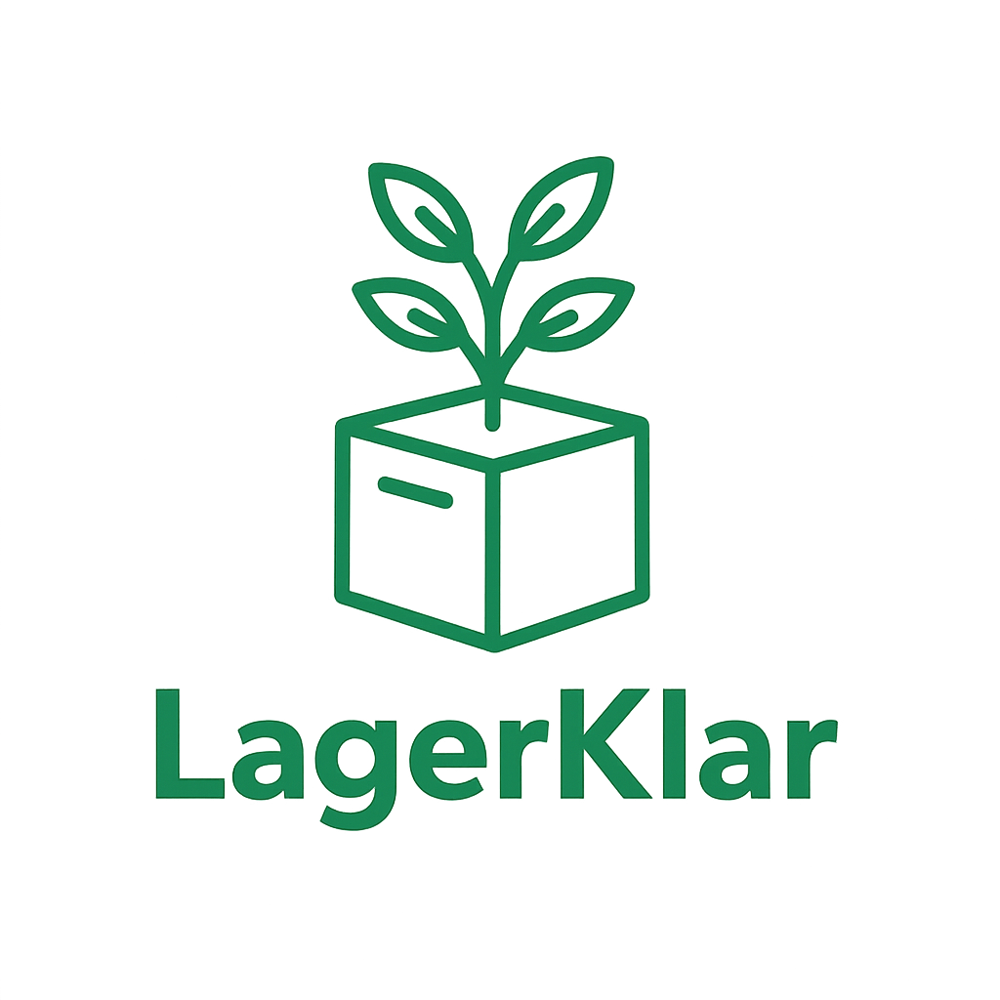
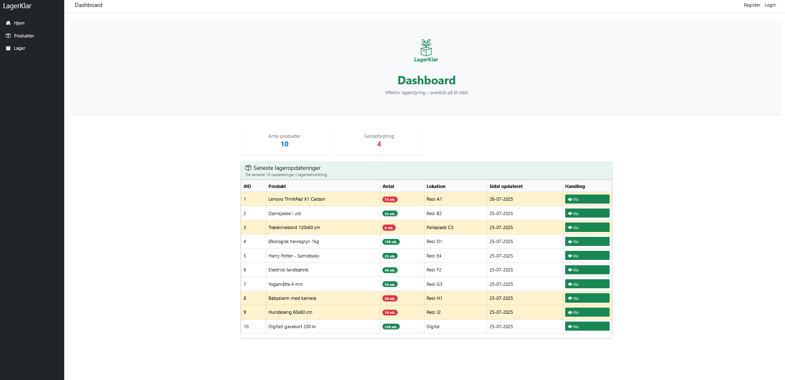
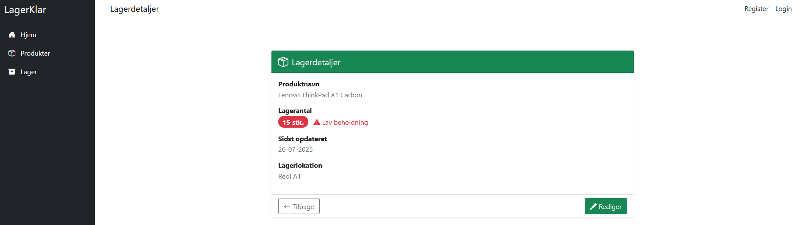
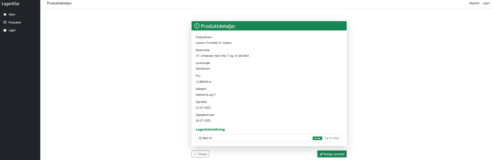
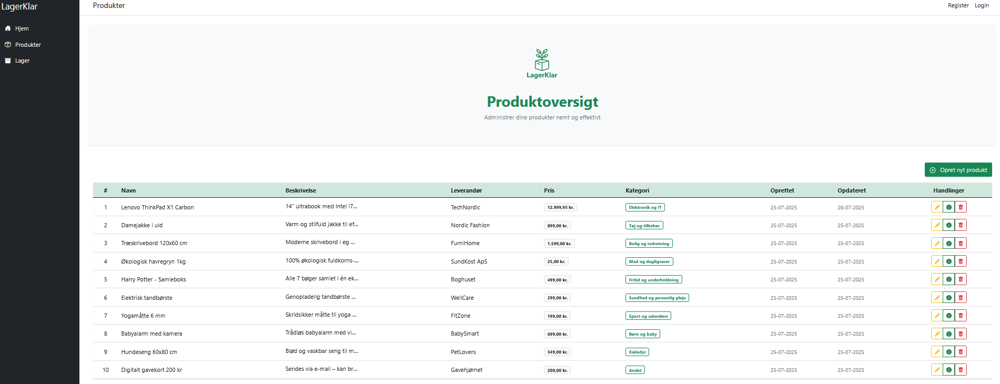
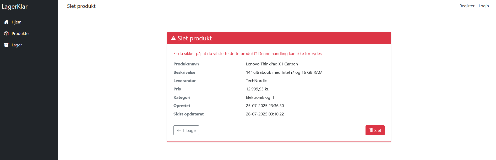

# 🏷️ LagerKlar – Northbyte Solutions

Et internt lagerstyringssystem udviklet i ASP.NET Core MVC og MSSQL. Projektet er fokuseret på nem håndtering af produkter, lagerbeholdning og lav-beholdningsmonitorering.

---

## 🚀 Overblik

Dette projekt er bygget som en teknisk øvelse og showcasesystem med fokus på:
- Klar arkitektur (lagdeling)
- Effektiv datahåndtering (Dapper & SQL)
- Automatisk opdatering af lagerstatus
- Brugervenlighed og UI/UX

---

### ⚙️ Teknologistak

- **ASP.NET Core Web API** – Backend-API til forretningslogik og datahåndtering  
- **ASP.NET Core MVC (Web App)** – Frontend bygget med Razor Views og klassisk MVC-struktur  
- **Microsoft SQL Server** – Relationel database til produkt- og lagerdata  
- **Dapper** – Lightweight ORM til direkte og effektiv databaseadgang  
- **SQLConnection** – Direkte styring af SQL-forbindelser og manuelle queries  
- **RestSharp** – HTTP-klient til integration mellem API’er og systemdele  
- **AutoMapper** – Automatisk mapping mellem domænemodeller og DTO’er  
- **System.Text.Json (JsonSerializer)** – Håndtering af JSON i API-laget  
- **Bootstrap 5** – UI-framework til responsive og moderne webgrænseflader  
- **JavaScript (Fetch API)** – Asynkrone kald til API (bl.a. polling for lav lagerbeholdning)

---

### 🖥️ Funktioner

- ✅ CRUD for produkter og lager
- ✅ Lagerlokation og minimumslager
- ✅ Formularhjælp og validering
- ✅ Brugervenlig struktur og layout
- ✅ Klar adskillelse mellem API og visning

---

### 📸 Screenshots
### Dashboard
- Få et hurtigt overblik over antal produkter og nødvendige genopfyldninger.
- Se de seneste opdateringer i lagerbeholdningen.

---

### Lagerdetaljer
- Se detaljer for specifikke produkter med lagerantal, placering og status for lav beholdning.

---

### Opret produkt
- Udfyld formular med navn, beskrivelse, leverandør, pris, kategori og lagerplacering.

---

### Produktdetaljer
- Få et komplet overblik over produktinformation, lagerstatus og historik.

---

### Produktoversigt
- Listevisning af alle produkter med mulighed for at se, redigere eller slette dem.

---

### Rediger produkt
- Opdater information og lagerstatus direkte fra produktkortet.

---

### Slet produkt
- Bekræft og slet produkter permanent.

---

### 🔒 Kildekode & adgang

Kildekoden er ikke offentliggjort, da systemet bruges som intern øvelse og mulig fremtidig udvidelse.  
Hvis du ønsker at se systemet i brug, tilbyder jeg gerne en live gennemgang eller demo ved forespørgsel.

---

## 📩 Kontakt

- **Navn:** NorthByte solutions 
- **Email:** [northbytesolutions@gmail.com](mailto:northbytesolutions@gmail.com)
- **Portfolio:** [https://northbytesolutions.carrd.co](https://northbytesolutions.carrd.co)
- **LinkedIn:** https://www.linkedin.com/in/thomas-h%C3%B8jlund-myllerup-b1a584285/
