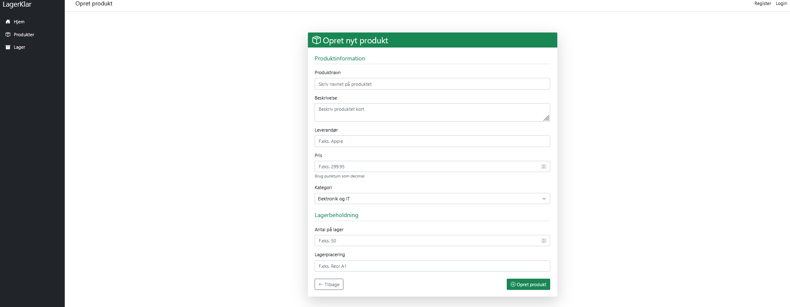

# 🏷️ Lagerstyringssystem – Northbyte Solutions

Et internt lagerstyringssystem udviklet i ASP.NET Core MVC og MSSQL. Projektet er fokuseret på nem håndtering af produkter, lagerbeholdning og lav-beholdningsmonitorering.

## 🔧 Teknologistak
- ASP.NET Core MVC (.NET 7)
- Entity Framework Core
- Microsoft SQL Server
- JavaScript (fetch API)
- Bootstrap 5

## 📦 Funktioner
- CRUD for produkter og lager
- Automatisk polling for lav lagerbeholdning
- Brugervenlig formular med validering og hints
- Lagerlokation og beholdningsstyring
- Dynamisk UI – uden side-refresh

## 📸 Screenshots

> (Indsæt billeder i repoet – fx i en `media/`-mappe)

## 🎥 Demo

> Se systemet i brug på under 2 minutter!

## 🔒 Hvorfor er koden ikke offentlig?
Kildekoden deles ikke, da projektet bruges til videreudvikling og sikkerhedstests. Jeg tilbyder dog gerne en demo eller teknisk walkthrough ved interesse – kontakt mig direkte.

## 📩 Kontakt
**Navn:** [Dit navn]  
**Email:** [din@email.dk]  
**Portfolio:** [https://northbytesolutions.carrd.co](https://northbytesolutions.carrd.co)
